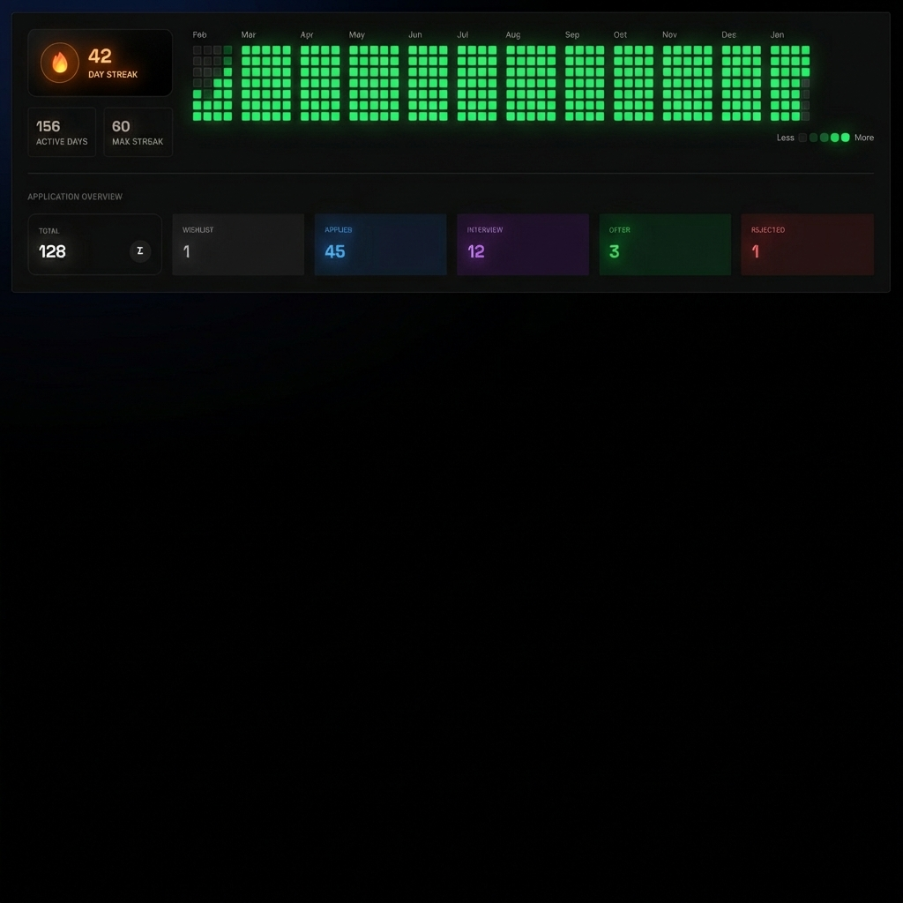

# Job Weave - Your AI Career Companion

Job Weave is the ultimate free tool for job seekers, designed to bring order to the chaos of job hunting. Track your applications, manage your career assets, and build consistency with our streak tracker—all in one beautiful, ad-free interface.

Built by **[The Closure Studio](https://theclosurestudio.vercel.app/)**.



## Features

### 🎯 Application Tracker

- **Kanban-style tracking**: Manage job applications with statuses like Wishlist, Applied, Interview, Offer, and Rejected.
- **Quick Add**: fast data entry for Company, Role, JD Link, and Remarks.
- **Search & Sort**: (Coming Soon) filtering to easily find past applications.

### 🔥 Streak Tracker

- **Github-style Heatmap**: Visualize your daily job search activity.
- **Gamification**: Earn streaks for daily activity (applications, interviews, etc.).
- **Stats**: View your Current Streak, Max Streak, and Total Active Days.

### 🗄️ Warehouse (Asset Manager)

- **Quick Links**: Store essential links like your Portfolio, LinkedIn, GitHub, and LeetCode in one click-to-copy panel.
- **File Storage**: Upload and manage Resumes, Cover Letters, and Portfolio assets directly in the dashboard.
- **Privacy**: Your assets are secure and accessible only to you.

## Tech Stack

- **Framework**: [Next.js 15](https://nextjs.org/) (App Router)
- **Styling**: [Tailwind CSS](https://tailwindcss.com/)
- **Database & Auth**: [Supabase](https://supabase.com/)
- **Animations**: [Framer Motion](https://www.framer.com/motion/)

## Getting Started

1.  **Clone the repository**:

    ```bash
    git clone https://github.com/your-username/job-weave.git
    cd job-weave
    ```

2.  **Install dependencies**:

    ```bash
    npm install
    # or
    yarn install
    ```

3.  **Environment Setup**:
    Create a `.env.local` file in the root directory and add your Supabase credentials:

    ```bash
    NEXT_PUBLIC_SUPABASE_URL=your_supabase_url
    NEXT_PUBLIC_SUPABASE_ANON_KEY=your_supabase_anon_key
    ```

4.  **Run the development server**:

    ```bash
    npm run dev
    ```

5.  Open [http://localhost:3000](http://localhost:3000) to view the app!

## Project Structure

- `app/` - Next.js App Router pages and layouts.
  - `dashboard/` - Main authenticated interface (Track, Streak, Warehouse).
  - `components/` - Reusable UI components.
  - `context/` - Global state (Auth).
- `lib/` - Utility functions and Supabase client.
- `public/` - Static assets.

## Contributing

We welcome contributions! Please feel free to verify our [Job Weave GitHub](https://github.com/Start-The-Closure-Studio/job-weave-web) for issues and pull requests.

## License

This project is open-source and free to use.

---

<div align="center">
  <p>Maintained by <a href="https://theclosurestudio.vercel.app/">The Closure Studio</a></p>
  <p>
    <a href="https://x.com/ClosureStudio">X (Twitter)</a> •
    <a href="https://www.instagram.com/theclosure.studio/">Instagram</a> •
    <a href="https://www.linkedin.com/in/koushik-yerraguntla">LinkedIn</a>
  </p>
</div>
